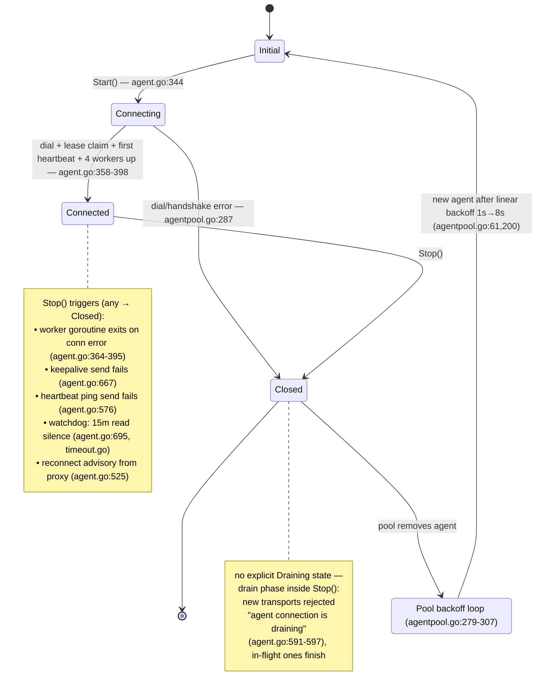
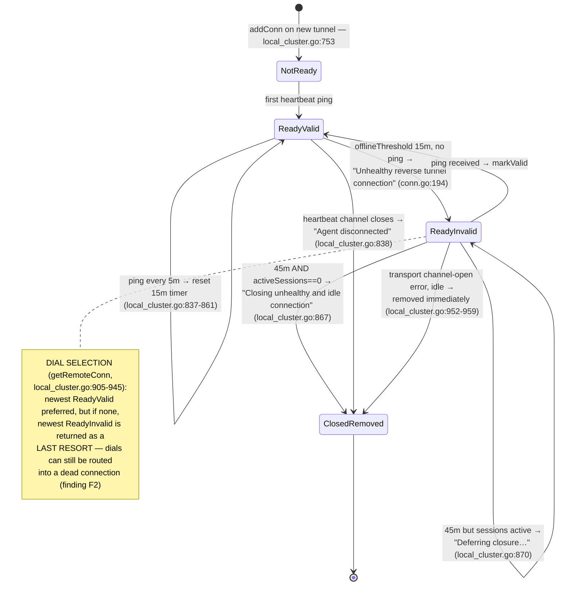
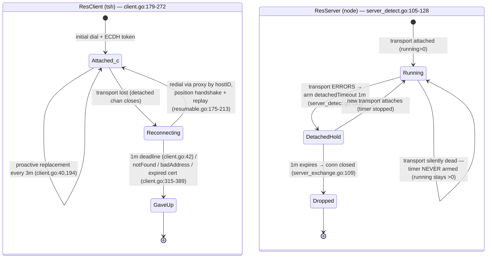
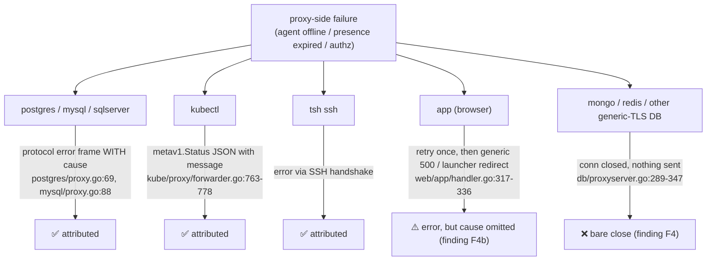

# Teleport Agent Tunnel — Diagram Sources (Mermaid)

Render locally (`mmdc -i 02-diagrams.md`, VS Code Mermaid preview, or paste into GitHub —
GitHub renders ```mermaid fences natively, so these drop straight into issues/PRs).
Citations match `01-tunnel-state-model.md`.

## 1. Layer map — `tsh db connect`

```mermaid
flowchart LR
    subgraph user["user's machine"]
        A[psql / mysql client] -->|plaintext TCP 127.0.0.1| B["tsh LocalProxy<br/>lib/srv/alpnproxy/local_proxy.go"]
    end
    B -->|"TLS + ALPN teleport-postgres"| C["ALPN router<br/>lib/srv/alpnproxy/proxy.go"]
    subgraph proxy["Teleport Proxy"]
        C --> D["db.ProxyServer<br/>lib/srv/db/proxyserver.go"]
        D --> E["reversetunnel localCluster<br/>lib/reversetunnel/local_cluster.go"]
    end
    E ==>|"SSH channel teleport-transport<br/>over agent-dialed tunnel"| F["AgentPool.handleLocalTransport<br/>lib/reversetunnel/agentpool.go:695"]
    subgraph agent["db agent"]
        F --> G["db Server + engine<br/>lib/srv/db/server.go:1161"]
    end
    G -->|TCP/TLS| H[(Database)]
    F -.->|"tunnel dialed agent→proxy<br/>lib/reversetunnel/agent.go"| E
```



## 2. Agent tunnel state machine (`lib/reversetunnel/agent.go:50-62`)



## 3. Proxy-side `remoteConn` lifecycle (`lib/reversetunnel/conn.go`, `local_cluster.go`)



## 4. Keepalive flows on an established tunnel

```mermaid
sequenceDiagram
    participant A as Agent
    participant P as Proxy
    Note over A,P: three independent mechanisms (defaults)
    loop every ~5m jittered (agent.go:664)
        A->>P: keepalive@openssh.com (wantReply) — agent.go:663
        P-->>A: reply (srv.go:429) — pets agent watchdog, updates SRTT
    end
    loop every 5m (agent.go:553)
        A->>P: "ping" on teleport-heartbeat (no reply) — agent.go:449
        Note right of P: resets per-conn offlineThreshold timer (15m)<br/>markValid (local_cluster.go:837-861)
    end
    loop every 5m HARDCODED = 15m/3 (sshutils/server.go:583)
        P->>A: keepalive@openssh.com — sshutils/server.go:702
        A-->>P: reply (agent.go:538)
        Note left of A: any read pets the 15m read-watchdog<br/>(interval×count, agent.go:695; timeout.go:115)
    end
```

## 5. Silent blackhole timeline (defaults; model-verified in `tcSilentDropIdle` / `tcDialDuringBlackhole`)

```mermaid
gantt
    title Tunnel TCP conn silently blackholed at t=100s
    dateFormat X
    axisFormat %s
    section Agent
    keepalives+pings vanish into kernel buffers  :active, 100, 1000
    watchdog fires (last read +900s), conn closed :milestone, 1000, 0
    backoff + redial + register                   :done, 1000, 1010
    section Proxy
    conn still VALID and selectable for dials     :crit, 100, 1000
    markInvalid "no heartbeats for 15m"           :milestone, 1000, 0
    invalid but still last-resort selectable      :active, 1000, 2800
    hard close at 45m if no active sessions       :milestone, 2800, 0
    section Client (dials in the window)
    dial hangs — transport open into dead TCP     :crit, 110, 1000
```



## 6. Resumption (ssh only) — client driver & server hold (`lib/resumption`)



## 7. Error propagation by client protocol (proxy-originated failures; model tests `tcAgentGone*`)


